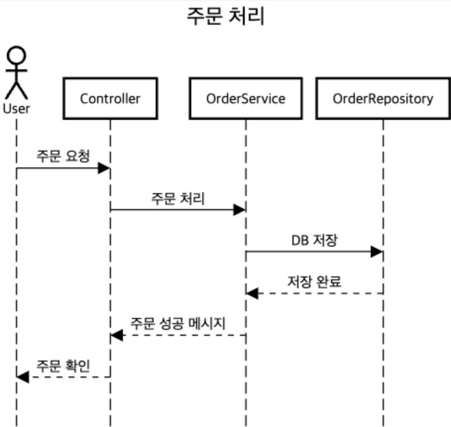

# Sequence Diagram

오늘은 소프트웨어 설계에서 중요한 역할을 하는 **Sequence Diagram**에 대해 작성하려고 한다.  
Sequence Diagram은 시스템의 상호작용을 시각적으로 표현하며, 객체 간 메시지 전달과 흐름을 이해하는 데 효과적인 UML 다이어그램이다.  
특히, **요구사항 분석**, **기능 설계**, **코드 리뷰** 등 여러 개발 단계에서 유용하게 활용된다.

---

## 1. Sequence Diagram이란?

Sequence Diagram은 시간의 흐름에 따라 객체 간의 메시지 교환을 표현하는 다이어그램이다.  
가로축은 **객체**, 세로축은 **시간**을 나타낸다.  
주로 다음과 같은 정보를 전달한다:
- 시스템의 동작 방식
- 객체 간 상호작용
- 메시지의 흐름과 순서
- 특정 기능의 실행 과정을 상세히 설명

---

## 2. 주요 구성 요소

- **Actor**: 시스템과 상호작용하는 외부 사용자 또는 시스템.  
- **Object**: 다이어그램 내에서 상호작용하는 내부 구성 요소.  
- **Message**: 객체 간 주고받는 요청과 응답.  
  - 동기 메시지 (실선 화살표): 호출 후 응답을 기다림.  
  - 비동기 메시지 (점선 화살표): 호출 후 응답을 기다리지 않음.  
- **Activation Bar**: 메시지를 처리 중인 활성 상태를 나타냄.  
- **Return Message**: 작업 완료 후 응답을 나타냄.

---

## 3. Sequence Diagram 예시

### **시나리오**:  
사용자가 쇼핑몰에서 제품을 주문하면, 주문 정보가 서비스 계층을 통해 데이터베이스에 저장되고, 주문 확인 메시지가 사용자에게 반환된다.

---

### **다이어그램 작성 예시**

아래는 [sequencediagram.org](https://sequencediagram.org)에서 작성할 수 있는 예제 코드와 출력 방식이다.

```
title 주문 처리

actor User
participant Controller
participant OrderService
participant OrderRepository

User -> Controller: 주문 요청
Controller -> OrderService: 주문 처리
OrderService -> OrderRepository: DB 저장
OrderRepository --> OrderService: 저장 완료
OrderService --> Controller: 주문 성공 메시지
Controller --> User: 주문 확인
```


**Output Example:**  
- 사용자 → Controller: "주문 요청"  
- Controller → OrderService: "주문 처리"  
- OrderService → OrderRepository: "DB 저장"  
- OrderRepository → OrderService: "저장 완료"  
- OrderService → Controller: "주문 성공 메시지"  
- Controller → 사용자: "주문 확인"

---

## 4. Sequence Diagram 작성 팁

1. **시나리오를 단순화하라**  
   - 너무 많은 객체와 메시지를 한 다이어그램에 넣으면 가독성이 떨어진다.  
   - 큰 시나리오는 작은 단위로 나눠 각각의 다이어그램으로 표현한다.  

2. **동기와 비동기를 명확히 구분하라**  
   - 호출 방식에 따라 메시지 화살표를 구분해 시스템의 동작 방식을 명확히 보여준다.  

3. **객체의 생명 주기를 표현하라**  
   - 객체 생성과 소멸 시점을 다이어그램에 포함하여 정확한 동작 흐름을 나타낸다.  

4. **시각적 도구 활용**  
   - [sequencediagram.org](https://sequencediagram.org)처럼 코드를 기반으로 다이어그램을 자동 생성해주는 도구를 활용하면 생산성이 높아진다.  

---

## 결론

Sequence Diagram은 시스템의 상호작용을 시각적으로 표현하는 데 유용한 도구다.  
다이어그램을 활용하면 팀 간의 커뮤니케이션이 원활해지고, 요구사항과 설계의 일치성을 높일 수 있다.