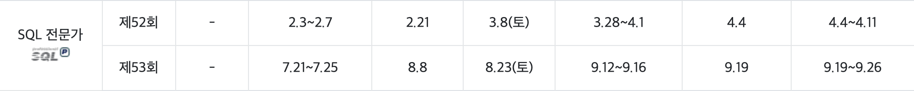

# 올해의 목표 자격증 리스트
`Update Date 2025.01.18`

---

## 1. SQLP - 미취득

- 제53회  
  - 필기: 접수기간 07.21~07.25, 응시 08.23
  - 실기: 접수기간 09.12~0916, 응시 09.19

## 2. 정보보안기사 - 미취득

- 제4회
  - 필기: 접수기간 09.01~09.04, 응시 09.15~10.02
  - 실기: 접수기간 09.15~10.23, 응시 11.15~11.30

## 3. 리눅스마스터1급 - 미취득

- 2차
  - 접수기간 10.06~10.17, 응시 11.08